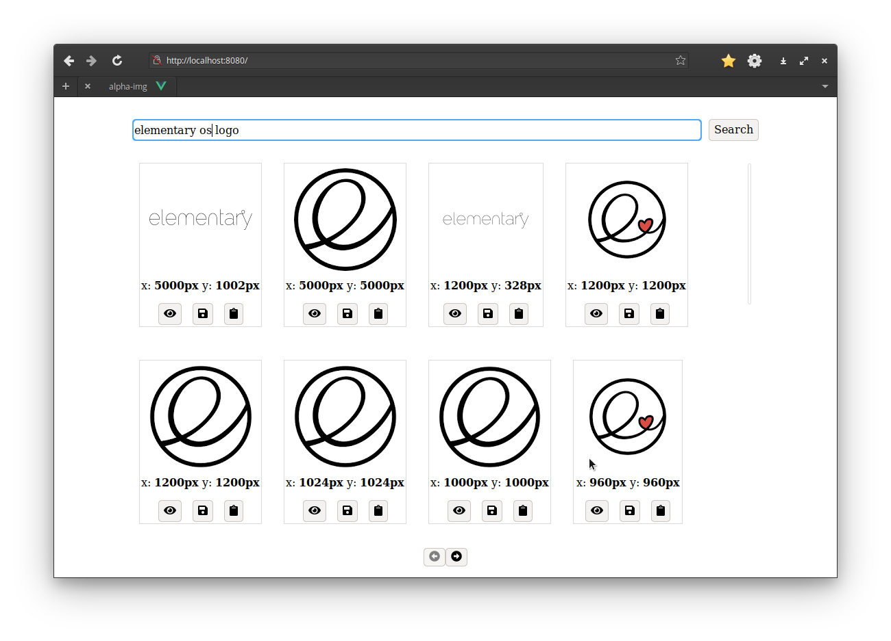

# alpha-img

A simple web app that has one simple goal: provide a quick search of images with
transparent backgrounds. A good example of usage is for presentations that require
various images with transparent backgrounds, or product/company logos.



## Features

- search for images using searchbar
- look through the results in a simple gallery, with pagination
- maximize the image by clicking on it or on the "eye" button
- copy the image into the clipboard with a click of a button
- open the image in its full size in another tab (again, with a click of a button)

The app uses Google Search API to fetch the results.

The project was created using the [Vue.js](https://vuejs.org/) framework.

## Project setup
```
npm install
```

### Compiles and hot-reloads for development
```
npm run serve
```

### Compiles and minifies for production
```
npm run build
```

### Lints and fixes files
```
npm run lint
```

### Customize configuration
See [Configuration Reference](https://cli.vuejs.org/config/).
